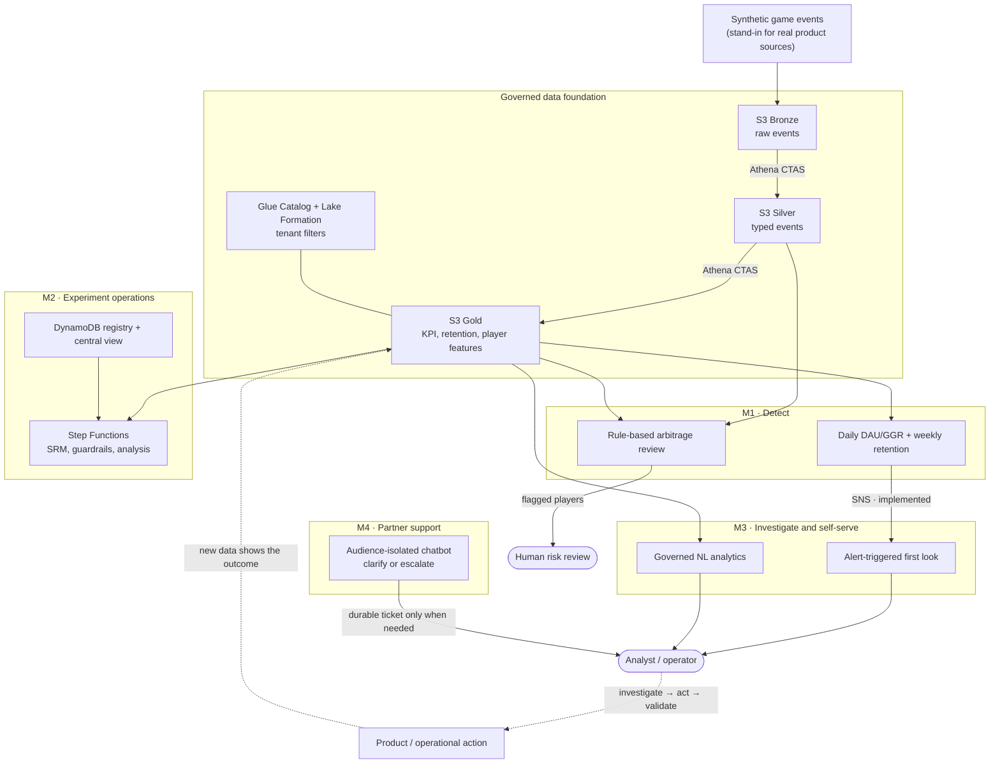

# Business-First AWS Game Data Platform

**Leon Lai · AWS Solutions Architect Portfolio**

[](https://github.com/leonlaiyc/aws_game_data_platform/actions/workflows/ci.yml)
[](LICENSE)

[**Open the bilingual interview demo →**](https://leonlaiyc.github.io/aws_game_data_platform/)

This project shows how I translate operating problems from B2B game analytics
into a governed, testable, and cost-conscious AWS architecture. It is a
portfolio PoC built with synthetic data—not a claim of production workload
experience.

## 1. Problems this project addresses

| Area | Operating problem |
|---|---|
| Anomaly and risk detection | Retention or revenue drops are noticed too late; known multi-account arbitrage patterns require manual investigation |
| Experiment operations | Concurrent A/B tests have no central status view, so people wait for stand-ups or ask owners one by one |
| Ad-hoc analytics | Sudden “why did revenue drop?” questions do not fit dashboards and repeatedly interrupt analysts |
| Partner support | Game providers and client operators repeat similar integration questions; unresolved cases consume engineering time |

The design goal is not to use as many AWS services as possible. It is to reduce
those four forms of operating friction while keeping tenant isolation,
explainability, and cloud cost explicit.

## 2. System architecture



**Solid arrows are implemented system integrations. Dashed arrows are human
decisions.** Module 2 is available when a controlled experiment is the right
validation method; it is not an automatic next step after every anomaly.

Default deployment uses eight CDK stacks across S3, Athena, Glue, Lake
Formation, Lambda, DynamoDB, Step Functions, EventBridge, SNS/SQS, API Gateway,
Bedrock, CloudWatch, and AWS Budgets. Kinesis is an explicit short-lived demo
stack and cannot be created by the default `cdk deploy --all`.

## 3. Data flow

### KPI / retention anomaly path

1. **[auto] Detect** — EventBridge runs daily DAU/GGR and weekly mature-cohort
   retention checks against published Gold data.
2. **[auto] First look** — Module 1 publishes an SNS alert; Module 3 builds
   baseline, per-game, or retention evidence before an analyst starts.
3. **[human] Investigate** — an analyst checks the evidence, business context,
   and likely root cause.
4. **[human] Act** — the team applies the appropriate operational or product
   response.
5. **[human-led] Validate** — confirm recovery through later KPI data, or use
   Module 2 when an A/B test is appropriate.

> Detection without investigation is noise. Investigation without validation
> is opinion. Action sits between them: evidence must lead to a response, and
> the response must be checked.

### Arbitrage path is separate

The rule-based arbitrage detector combines device fan-out with abnormal
cash-out behaviour, writes explainable evidence, and returns
`REVIEW_REQUIRED`. It is implemented and demoed, but it does **not** enter
Module 3's KPI first-look flow. Unknown-technique novelty detection is
deliberately not claimed because the PoC has no reviewed labels or calibrated
false-positive threshold.

### Shared governed data flow

```text
synthetic events
  → S3 Bronze
  → Athena CTAS / S3 Silver
  → Athena CTAS / S3 Gold
  → Glue Catalog + Lake Formation policy
  → M1 detection / M2 experiment analysis / M3 governed analytics
```

`KPI_DEFINITIONS.md` governs Gold tables, Module 2 metrics, and Module 3 query
templates. `FEATURES.md` defines shared experiment features. Tenant scope comes
from authenticated identity rather than a request body.

## 4. How the architecture solves the problems

| Problem | Implemented response | Honest boundary |
|---|---|---|
| Late anomaly discovery | Scheduled DAU/GGR and mature-retention checks; SNS automatically triggers a code-rendered first look | No real ingestion source, so no end-to-end freshness SLA claim |
| Known arbitrage patterns | Two independent signals, explainable evidence, and a non-final `REVIEW_REQUIRED` decision | No claim of detecting previously unseen techniques |
| Invisible experiment status | Central registry/view with owner, IAM-derived provenance, lifecycle, SRM, guardrail, and allocation state | Local signed UI; hosted SSO UI waits for regular multi-user demand |
| Delayed experiment stopping | Live-exposure SRM, hourly guardrail monitoring, and an atomic allocation kill switch | Worst-case monitoring cadence is one hour, not real time |
| Repeated feature work | Shared `gold_player_features` registry and documented feature definitions | Automated lineage waits for a measurable duplication incident |
| Ad-hoc “what/why” questions | Allow-listed SQL, on-demand `diagnose`, alert-triggered reports, and durable tickets | Country/player-level external analytics waits for governed dimensions and federation |
| Repeated partner questions | Identity-derived provider/operator corpora, clarification before escalation, leakage guard, daily quota, and API throttle | Production partner IdP, time-zone profiles, conversation history, and CRM delivery remain |

## 5. Additional design evidence

### Design principles

- **Business first:** each service must map to an operating problem.
- **Cost first:** default resources are request-priced or scale to zero; the
  steady-state gross model is under **USD 2/month**, with a USD 5 budget alert.
- **Identity owns scope:** tenant or audience scope is never trusted from the
  request body.
- **Code owns facts:** SQL, numbers, risk evidence, routing, and disclosure are
  deterministic; an LLM only phrases approved qualitative content.
- **Gaps stay visible:** production boundaries have adoption triggers instead
  of aspirational architecture boxes.

### Evidence

- [Architecture and service trade-offs](ARCHITECTURE.md)
- [Rendered Mermaid diagrams](diagrams/)
- [Cost model and 100× projection](docs/cost-analysis.md)
- [Threat model and SLOs](docs/threat-model.md)
- [Project closeout and intentional boundaries](docs/project-closeout.md)
- [Five designs changed by testing](docs/what-i-got-wrong-first.md)
- [Operational runbook](docs/runbook.md)

### Verification status

- **144 offline tests** plus Python compilation and CDK assertion coverage.
- **Eight default stacks** synthesize without Kinesis, NAT Gateway, RDS,
  OpenSearch, or provisioned compute.
- The earlier baseline was deployed and exercised against AWS on 2026-07-29.
  The latest cost-safe increment is locally/CI verified and was not redeployed,
  so no new AWS cost was created during closeout.
- All entities and data are fictional. See [SECURITY.md](SECURITY.md).

<details>
<summary><strong>Run locally</strong></summary>

Tests and synthesis do not require an AWS deployment:

```bash
python -m pytest -q
cd infra
cdk synth --quiet
```

Before any later deployment:

```bash
python scripts/verify_paid_account_controls.py
cd infra
cdk deploy --all
```

The streaming demo is opt-in only:

```bash
cdk deploy AuroraGamesStreamingStack -c enable_streaming=true
```

Use the wrapper in `module1-anomaly-detection/streaming/` to deploy, demo,
destroy, and independently verify teardown.

</details>

<details>
<summary><strong>Repository map</strong></summary>

```text
data-foundation/                     governed lake, KPI definitions, tenant isolation
module1-anomaly-detection/           KPI/retention anomaly and rule-based arbitrage paths
module2-experimentation-platform/    central registry, live controls, feature registry
module3-analytics-assistant/         governed Q&A and first-look diagnosis
module4-partner-support-chatbot/     audience-isolated partner support
infra/                               AWS CDK application
tests/                               offline unit, security, and CDK assertions
site/                                bilingual GitHub Pages interview demo
docs/                                cost, threat model, runbook, boundaries, lessons
```

</details>

Licensed under the [MIT License](LICENSE).
