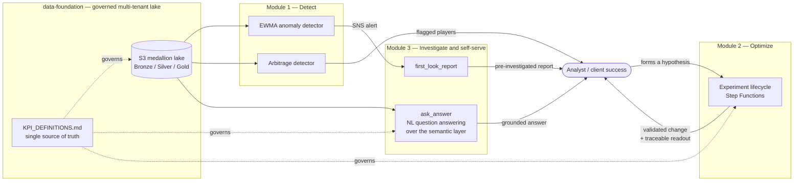
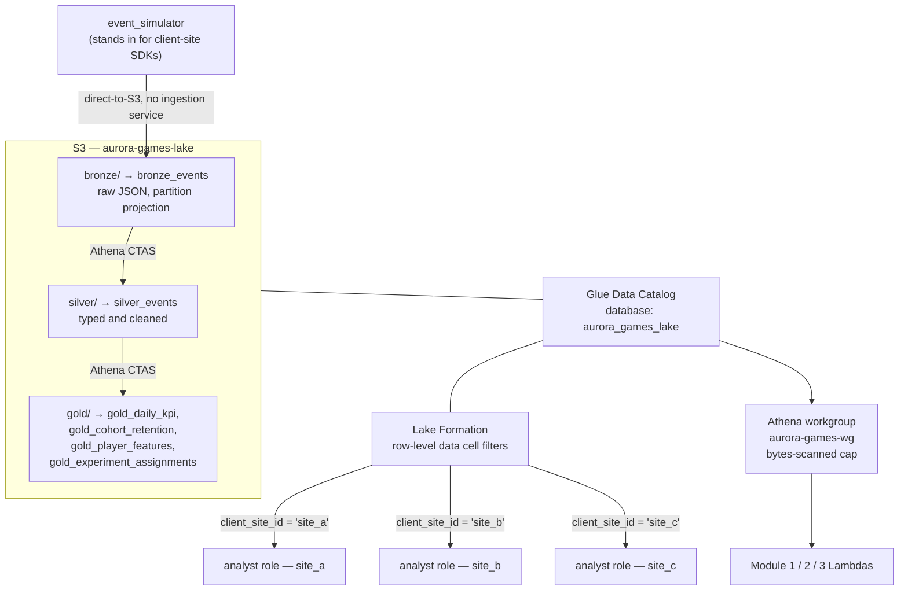
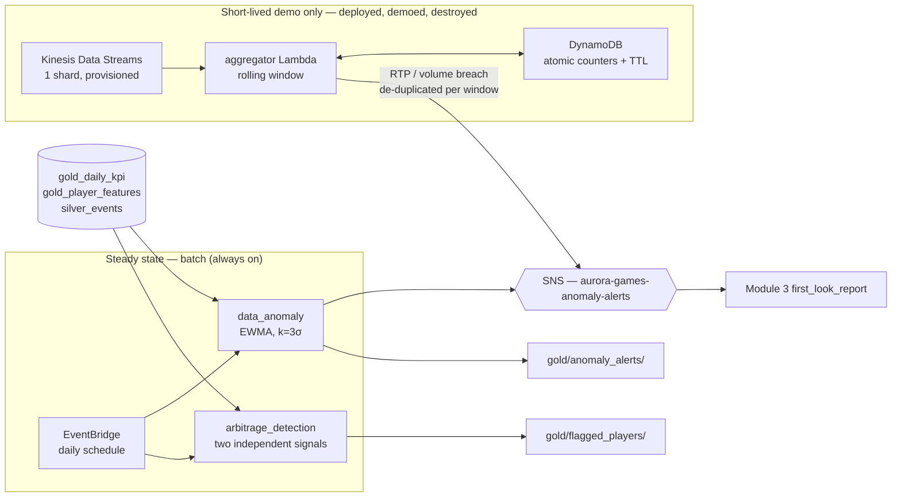
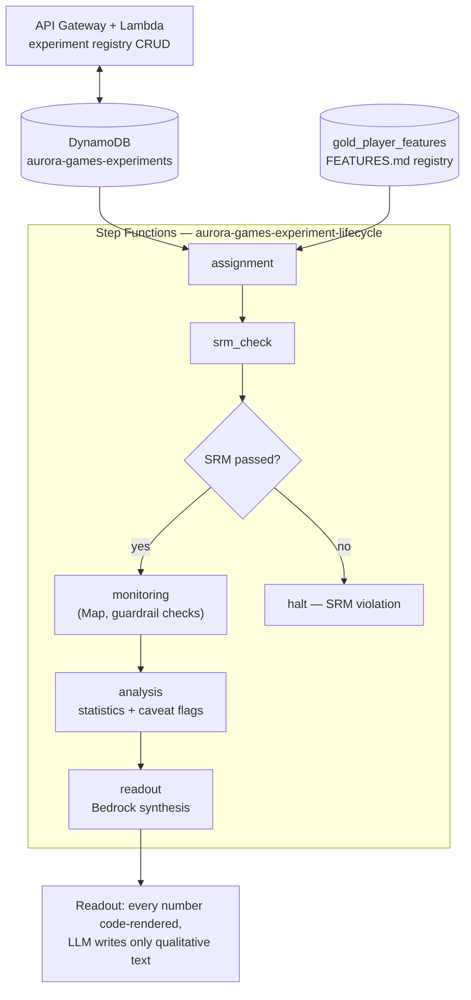
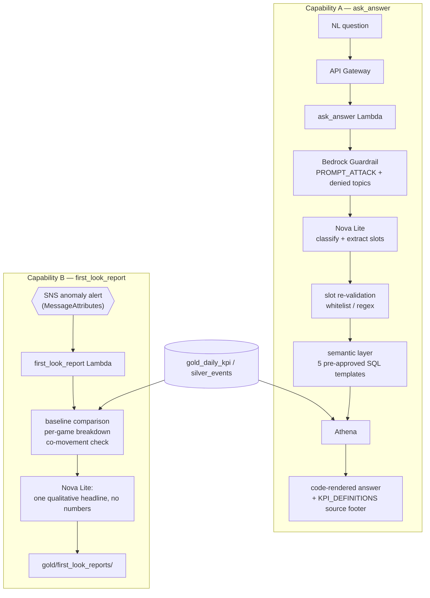
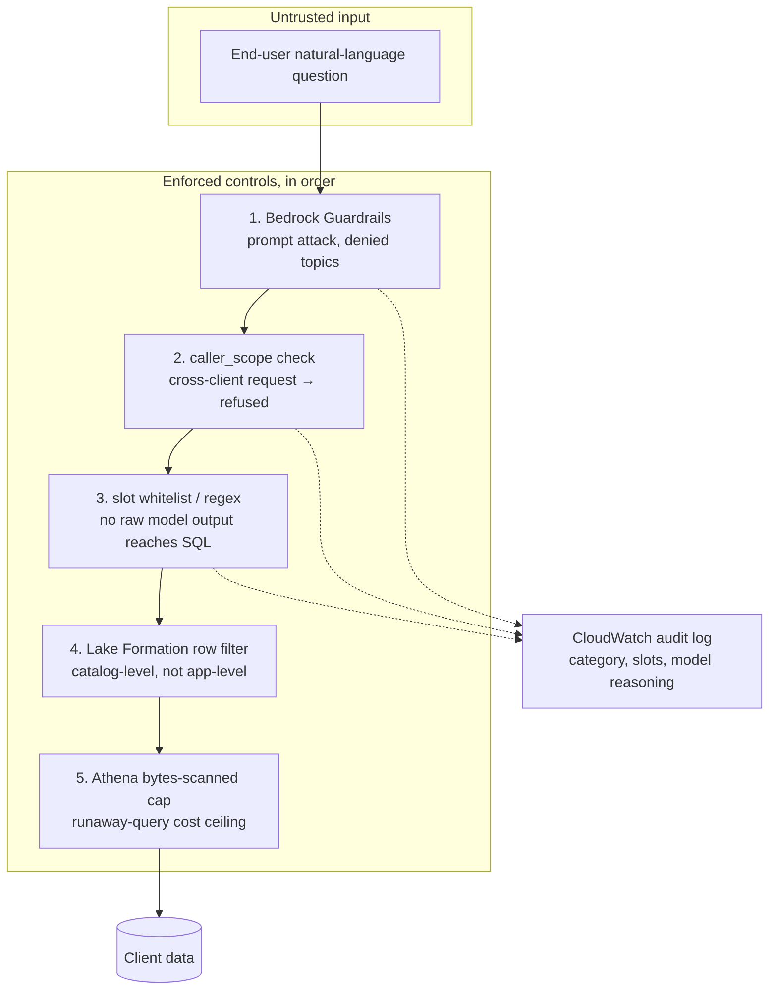

# Architecture Diagrams

Mermaid rather than exported images: GitHub renders these natively, they diff meaningfully in
version control, and they can't drift out of sync with the code the way a stale PNG does.

Each diagram reflects what is actually deployed (verified against `aws glue get-tables`,
`aws stepfunctions list-state-machines`, and the CDK stacks in [`infra/infra/`](../infra/infra/)),
not an aspirational design.

---

## 1. The platform as one closed loop

The four pieces are not four separate demos. They form a loop: the governed foundation feeds
detection, detection hands off to investigation, investigation produces a hypothesis, and the
experimentation platform validates that hypothesis before a change is trusted — which then shows
up back in the foundation's numbers.

The dotted lines matter as much as the solid ones: one metric-definition document governs the
lake's Gold tables, Module 3's semantic layer, and Module 2's experiment metrics. That's what
stops "GGR" from meaning three different things in three different places.

---

## 2. Data foundation, catalog, and client isolation

**Why direct-to-S3 rather than Kinesis Firehose for ingestion:** at this project's volume the
buffering service would be pure overhead and permanent cost. See
[ARCHITECTURE.md](../ARCHITECTURE.md) for the scale threshold at which that flips.

**Isolation is enforced at the catalog, not in application code.** Each analyst role is
physically unable to read another client's rows — verified by assuming each role via STS and
confirming it sees only its own site
([`data-foundation/governance/verify_isolation.py`](../data-foundation/governance/verify_isolation.py)).
Application-level filtering would be a bug away from a cross-tenant leak; this is not.

---

## 3. Module 1 — dual detection path

The streaming path exists to demonstrate the capability and the reasoning, **not** as part of the
steady-state architecture — Kinesis bills per shard-hour with no free tier, so it is deployed and
torn down around its demo. The batch path is what actually runs.

---

## 4. Module 2 — experiment lifecycle

`analysis` computes deterministic caveat flags (`SAMPLE_IMBALANCE`, `SMALL_SAMPLE`,
`GUARDRAIL_NEAR_THRESHOLD`, `SUSPICIOUSLY_LARGE_EFFECT`, `WIDE_UNCERTAINTY`) in code. The readout
prompt *requires* the model to address every flag present — it chooses only how to phrase the
caveat, never whether to mention it.

---

## 5. Module 3 — two capabilities, one grounding rule

**The model never writes SQL and never states a number.** It picks a template and fills slots from
a closed set; those slots are re-validated against a whitelist before substitution. Every figure
in the response comes from a query result rendered by Python.

---

## 6. Trust boundary

Five independent controls, each of which would have to fail for a cross-tenant leak or an
injection to reach data. Note that control 4 sits *below* the application — even a fully
compromised Lambda cannot read another client's rows, because the filter is enforced by Lake
Formation when the query is planned.
